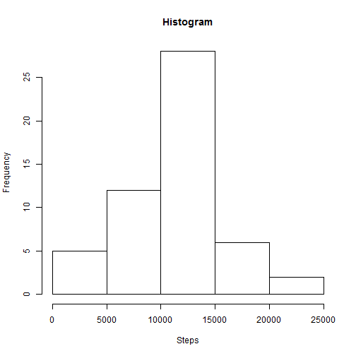
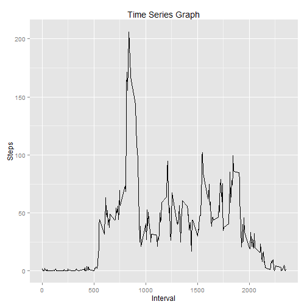
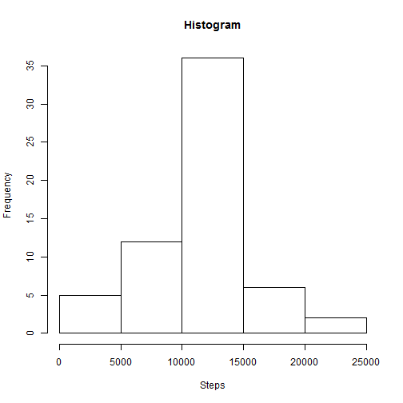
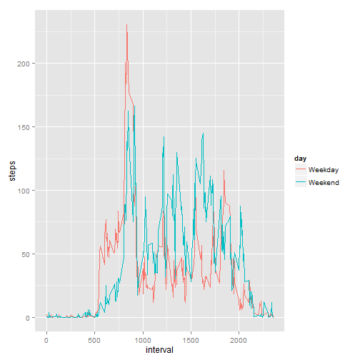
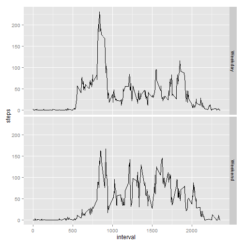

Reproducible Research Project 1
===============================

##Get the data into a usable format

```r
activity <- read.csv("activity.csv") #read in the data
library(data.table) #load the required package for a data table
dt <- data.table(activity) #convert to a data table
dt$date <- as.POSIXct(dt$date) #convert the date variable to a POSIXct object
```
##What is the mean total number of steps taken per day?

```r
library(ggplot2)
stepday <- dt[,list(steps = sum(steps)), by = "date"] #create the required data table to perform first analysis
hist(stepday$steps, main = "Histogram", xlab = "Steps") #plot the data
```

 

```r
summary(stepday$steps) #output the summary statistics
```

```
##    Min. 1st Qu.  Median    Mean 3rd Qu.    Max.    NA's 
##      41    8841   10760   10770   13290   21190       8
```
##What is the average daily activity pattern?

```r
library(ggplot2) #load the required package to create the graph
daily <- aggregate(data = dt, steps ~ interval, FUN = mean) #use aggregate to get the mean of steps broken down by interval
g <- ggplot(data = daily, aes(x = interval, y = steps)) #create the ggplot object
g + geom_line() + labs(title = "Time Series Graph", x = "Interval", y = "Steps") #create the time series ggplot
```

 

```r
max <- daily[grep(max(daily$steps), daily$steps),] #find the interval with the max number of steps
```
It appears that the interval with the max average steps is 835.  

##Inputting missing values

```r
numna <- sum(is.na(dt$steps)) #calculate how many missing entries there are
```
There are 2304 missing values in the data set  

```r
newdf <- merge(daily, activity, by = "interval") #create the new df by merging daily & activity
navec <- is.na(newdf$steps.y) #create a vector of the NA observations
newdf$steps.y[navec] <- newdf$steps.x[navec] #transfer the step observations of daily (step.x) to those missing in newdf (steps.y)
newdf <- newdf[, c(1, 3, 4)] #remove unneeded variables
names(newdf) <- c("interval", "steps", "date") #rename variables
```

```r
newdt <- data.table(newdf) #create a data table of newdf
stepday2 <- newdt[,list(steps = sum(steps)), by = "date"] #create the required data
hist(stepday2$steps, main = "Histogram", xlab = "Steps") #create the histogram
```

 

```r
summary(stepday2$steps) #get the summary statistics
```

```
##    Min. 1st Qu.  Median    Mean 3rd Qu.    Max. 
##      41    9819   10770   10770   12810   21190
```

```r
newdt$date <- as.POSIXct(newdt$date) #convert the newdt$date variable to POSIXct object
newdt$day <- weekdays(newdt$date) #use weekdays() to convert dates to day of the week
newdt$day <- ifelse(newdt$day == "Saturday" | newdt$day == "Sunday", "Weekend", "Weekday") #use ifelse to change to what we need
daily2 <- aggregate(data = newdt, steps ~ interval + day, FUN = mean) #use aggregate() to create required data
qplot(data = daily2, x = interval, y = steps, col = day, geom = "line") #qplot the time series graph and color by day
```

 

```r
qplot(data = daily2, x = interval, y = steps, facets = (day~.), geom = "line") #use facets to create another view
```

 
